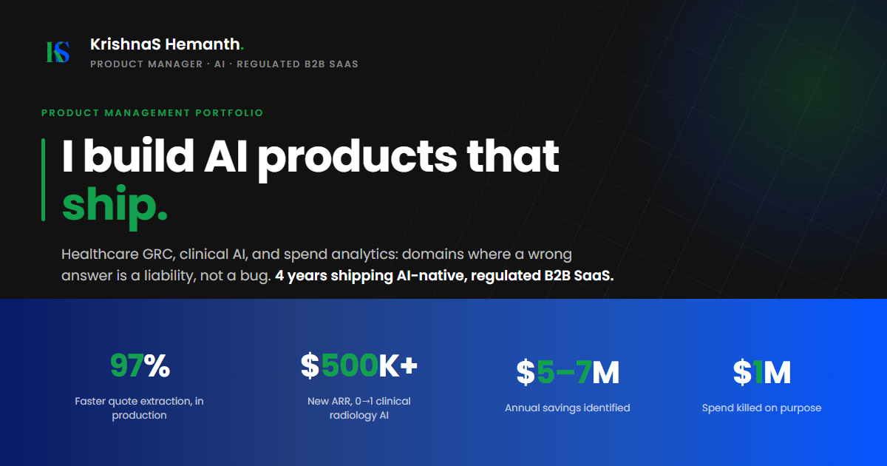

# KrishnaS Hemanth | Product Manager Portfolio

This repository contains the source code for my professional portfolio, available live at **[krishnashemanth.github.io](https://krishnashemanth.github.io)**.

The site is designed to serve as a comprehensive, narrative-driven overview of my approach to Product Management — specifically focusing on shipping AI in B2B SaaS, healthcare, and enterprise GRC environments where compliance is the true constraint.

## 🏗️ Technical Approach

The site intentionally avoids heavy Javascript frameworks (React/Next.js) or bloated utility libraries (Tailwind) in favor of **pure semantic HTML and Vanilla CSS**, with a single small JS file for nav scroll behavior.

**Why?**
*   **Performance:** Near-zero JS overhead guarantees instant load times and perfect Core Web Vitals.
*   **Resilience:** No dependency hell, no package updates, no breakages.
*   **Design Control:** A fully bespoke CSS token system (Poppins typeface, navy/blue/green palette) ensures exact typographic hierarchy, strict responsive gutters, and consistent theming.

## 📂 Architecture & File Structure

The project relies on a flat HTML file structure tied to a singular global stylesheet.

*   `index.html` — The landing page. High-level pitch, core value propositions, and all case studies.
*   `about.html` — Extended professional background, skillset taxonomy, timeline, and operating principles (`#principles`).
*   `resume.html` — A web-native, printable version of my resume.
*   `manifesto.html` — Redirects to `about.html#principles` (kept for backward-compatible links).
*   `case-*.html` — Nine dedicated, long-form case studies, including:
    *   **LLM + RAG Quote Automation** (Scaling throughput without removing Human-in-the-Loop compliance).
    *   **Clinical Radiology AI** (Pivoting from speed-first to interpretability-first in FDA SaMD).
    *   **The Killed Project** (Saving $1M by identifying PHI/PII compliance blockers in the discovery phase).
    *   **Phoenix** (Legacy modernization: rebuilding a 20-year, 366-screen application).
    *   Command Center, Compliance Content AI, Regulatory Intelligence, and the report-generation POC stopped for a compliance reason.
*   `styles.css` — The design system. Controls CSS tokens, typographic scale (`Poppins`), and layout components.
*   `nav-scroll.js` — Minimal vanilla JS toggling nav styling on scroll.
*   `assets/` — Favicon and OpenGraph metadata image.

---
*If you are a hiring manager or recruiter reading this, please reach out directly at [krishnashemanth@gmail.com](mailto:krishnashemanth@gmail.com).*
